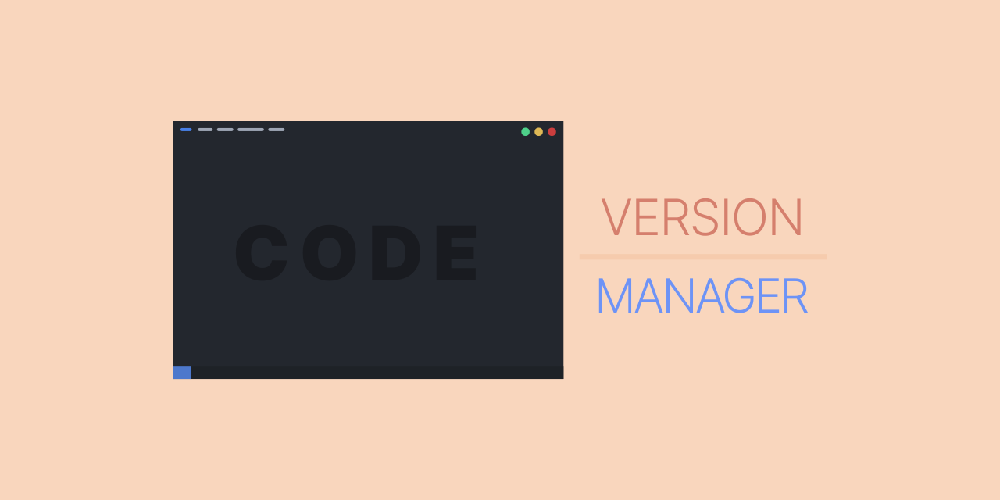

# VSCODE VERSION MANAGER



Any vscode on any \*nix

## Table of content
- [Intro](#intro)
- [About](#about)
    - [Short story](#short-story-about-the-origins-of-this-project)
- [Installing](#installing)
    - [Uninstalling](#uninstalling)
- [Usage](#usage)
    - [Downloading & Installing packages](#downloading--installing-vscode)
    - [Version info](#versions-info)
    - [Misc](#miscelaneous)

## Intro

`codevm` allows for quick downloading and installing any version of vscode via the command line.

**Example:**
```sh
# List available versions
$   codevm list
1.67.0 - insiders
1.66.0
1.65.0
[...]

# Get the latest stable release
$   codevm download stable
VsCode stable downloaded

# Get and install the insiders version
$   codevm install insider
VsCode insiders installed
```

Simple and intuitive!

## About

`codevm` - a version manager for vscode, works on any POSIX-compliant shell like `bash`, `zsh` or `fish`.

### Short story about the origins of this project

I was furious when realized that the distribution of linux, which I was using at the time, did not include a proper vscode package in their package manager repository. And then I thought to myself: "Wouldn't it be nice, if I could have ** any version ** of vscode at my call?" - the idea was born.

## Installing

Currently, cloning git repo is the only way to go
```sh
git clone https://github.com/Adamocho/codevm.git ~/.cache/codevm
```
Check whether `~/.cache/codevm.sh` is executable, and if not - change it
```sh
[sudo] chmod +x ~/.cache/codevm.sh
```

Now, add it to path
```sh
~/.cache/codevm.sh add
```
From now on, the `codevm` command will be available for every user

## Uninstalling

Delete the script from your path

```sh
codevm remove
```
Remove the *codevm* folder from your .cache directory
```sh
rm -r ~/.cache/codevm
```

## Usage

This section describes a basic usage of this script

### Downloading / Installing vscode

For downloading, use: `download` | `-d`
```sh
codevm download <stable/insider/specific_version>
```

For installing, use: `install` | `-i`
```sh
codevm install <stable/insider/specific_version>
```

### Versions info

See the docs in your browser with `docs`
```sh
codevm docs
```

See the current version website with `summary`
```sh
codevm summary
```

Update versions list with `fetch`

*then*

Inspect it with `list`
```sh
codevm fetch
# Then
codevm list
```
### Miscellaneous

`-h` for help

`-v` for version